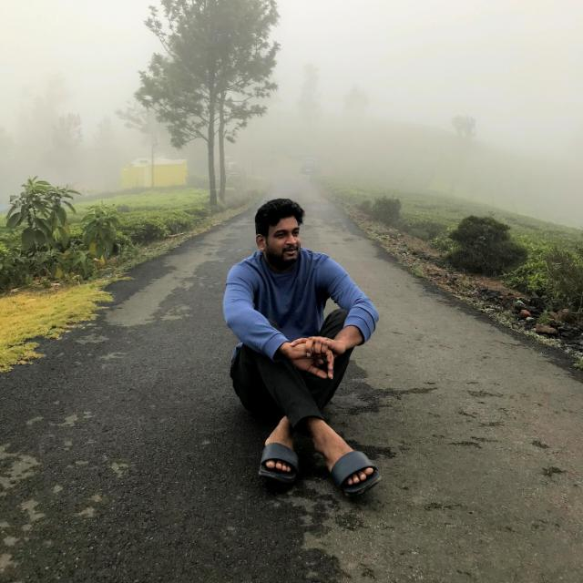

# Shanmuk Sai Palnati

My name is Shanmuk. I am from hyderabad. I finished my under graduation in the year 2017 from CVR college of Engineering with major in Electrical and Electronics Engineering. For my final project, I have receivd the best project award from the college. I have been hired by 2 companies, DXC.Technology and Accenture. I have started my career with DXC. Technology in Bangalore. I have worked there for nearly 2 years as a full stack developer. Later, I moved to Appshark Software which is located in hyderbad and worked with them for 3 years. Currently, I have a total work exprerience of 5 years in the field of Information Technology.

